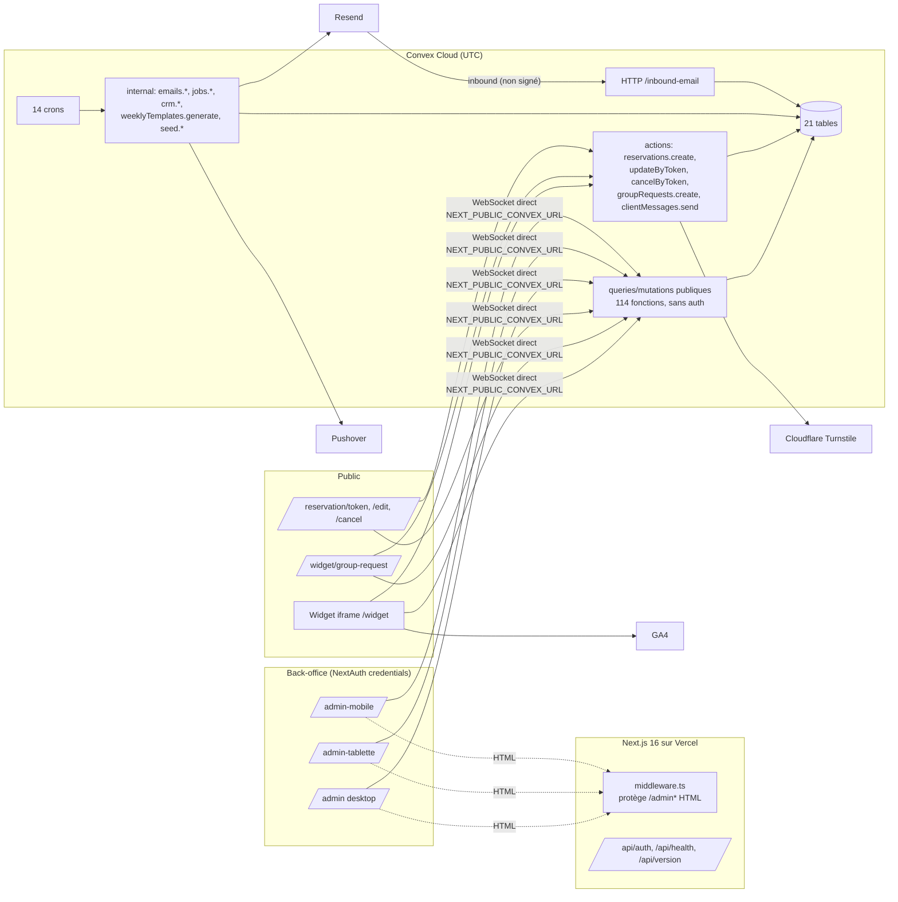
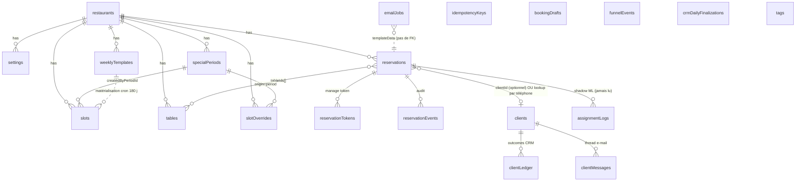
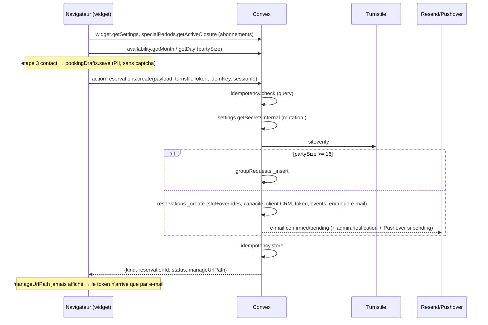
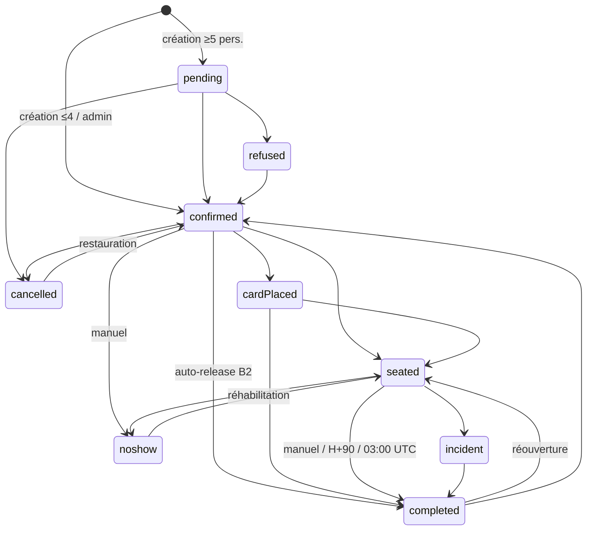

# Audit technique complet — Resa La Moulinière

**Date** : 2026-09-03
**Dépôt audité** : `AGBVconsult/resa-la-mouliniere`, branche `main` @ `9b8edc5` (55 commits, 1 auteur, historique démarrant le 2026-02-28)
**Nature** : Technical Due Diligence + audit d'architecture, de code, de sécurité, de données, de performance/scalabilité, d'exploitation et de qualité.
**Méthode** : lecture intégrale du code (`convex/`, `src/`, `spec/`, `scripts/`, `tests/`, `e2e/`, configuration), confrontation documentation ↔ contrat ↔ code ↔ tests, exécution réelle de `tsc`, `vitest`, `eslint`, `contracts:check`, `pnpm audit`. Aucune observation runtime en production (pas d'accès au déploiement Convex/Vercel, ni aux logs, ni aux données).

Conventions de confiance : **CONFIRMÉ** (démontrable dans le dépôt), **FORTEMENT PROBABLE** (plusieurs éléments cohérents), **HYPOTHÈSE** (plausible, à confirmer), **NON DÉTERMINABLE**.
Sévérités : **P0** critique (sécurité/perte de données/panne), **P1** haute, **P2** moyenne, **P3** opportunité.

---

## 1. Executive Technical Summary

**Le produit.** Système de réservation pour un restaurant unique (La Moulinière, Ostende) : widget public multilingue embarqué en iframe, gestion de réservation par lien/token (modification, annulation), back-office sur trois surfaces (desktop, tablette iPad en salle, mobile), plan de salle avec attribution de tables, CRM clients (scoring, notes, tags, messagerie e-mail), périodes spéciales/fermetures, templates horaires, e-mails transactionnels (confirmation, validation, rappel H-2, avis J+1, no-show), notifications push, analytics de funnel.

**La stack.** Next.js 16 (App Router, React 19, React Compiler) déployé sur Vercel ; backend Convex (base de données réactive + fonctions serverless + crons) ; NextAuth v5 (beta) en mode "credentials" mono-compte ; Resend, Cloudflare Turnstile, Pushover, GA4. ~47 000 lignes TypeScript, dont ~14 500 dans `convex/`.

**État général.** Le système est fonctionnellement riche, en production, et porte de vraies bonnes décisions (Convex adapté au temps réel de la salle, machine d'états explicite, file e-mail idempotente avec retry, tokens cryptographiques, contrat écrit, PRDs détaillés, helpers purs testables). Mais l'audit met en évidence un **défaut de sécurité structurel de niveau P0** et une **dette de cohérence** qui rend le comportement métier imprévisible.

**Faiblesse majeure n°1 — le backend est ouvert (P0, CONFIRMÉ).** Convex n'a aucune configuration d'authentification ; `requireRole()` retourne toujours `"owner"` ; le client web parle directement à Convex avec une URL publique embarquée dans le widget. Conséquence : **toutes** les fonctions d'administration (lecture intégrale du CRM et des réservations avec PII, suppression de clients/tables/périodes, fermeture du calendrier, remplacement de la clé secrète Turnstile et de l'URL des liens e-mail, envoi d'e-mails au nom du restaurant, création de réservations sans captcha) sont exécutables par quiconque, sans compte. Le middleware Next.js ne protège que des pages HTML. Le script `scripts/import-clients-csv.ts` en est la démonstration vivante : il appelle une mutation publique sans aucun jeton.

**Faiblesse majeure n°2 — plusieurs vérités pour une même règle.** La capacité d'un créneau est calculée dans cinq endroits avec des règles différentes ; « aujourd'hui » et l'heure d'un créneau sont calculés par quatre helpers dont deux ignorent le fuseau ; la résolution templates → slots → overrides diverge entre widget, création admin et planning ; les transitions d'état existent en cinq tables (serveur + quatre UI) qui se contredisent ; le contrat `CONTRACTS.md`, déclaré source de vérité, décrit Clerk, Tailwind v4, des crons et une machine d'états qui ne sont plus ceux du code. Résultat : surbooking silencieux possible (`updateReservationFull` écrit un `slotKey` malformé), boutons admin qui échouent systématiquement, visites CRM perdues, et une suite de tests unitaires **rouge depuis le premier commit** (22 échecs sur 288).

**Faiblesse majeure n°3 — absence de filet.** Pas de CI, pas de hook, lint non bloquant (126 erreurs), deux lockfiles divergents, 4 vulnérabilités critiques et 30 hautes dans les dépendances (dont des contournements de middleware Next.js — précisément la seule barrière d'authentification), E2E inexécutables et à assertions vides, observabilité réduite à `console.log`, sauvegardes non documentées, documentation de statut figée à « 100 % » depuis février.

**Risques les plus importants (ordre)** : (1) exfiltration/altération des données clients et sabotage du calendrier via l'API ouverte ; (2) phishing par réécriture de `appUrl` ; (3) surbooking et incohérences de capacité ; (4) dérive silencieuse des crons (limite de lecture Convex, doublons de `slotKey` faisant échouer la génération nocturne) ; (5) impossibilité de prouver la non-régression.

**Verdict architectural.** L'architecture (Next.js + Convex, monolithe modulaire serverless) est **pertinente pour ce produit** ; elle n'est pas la cause des problèmes. Les causes profondes sont : l'absence de frontière d'authentification côté données, l'absence d'une couche « domaine » partagée (résolution de disponibilité, capacité, temps), et l'absence de processus qualité. La complexité accidentelle (multi-tenant fantôme, module ML mort, stubs dépréciés, trois back-offices dupliqués, outillage IA commité à 51 % des fichiers) est significative mais réductible sans réécriture.

**Recommandation stratégique : REFACTOR**, avec un chantier de ré-architecture ciblé sur le sous-domaine « disponibilité » (templates/slots/overrides) et une remise à plat de la sécurité en tout premier lieu. Une réécriture serait irrationnelle : le coût de migration dépasse le bénéfice, et le système cible réalisable sur la stack actuelle couvre l'essentiel des besoins.

---

## 2. Scorecard

| Domaine | Note /10 | Justification |
|---|---|---|
| Architecture | **4** | Choix de stack cohérent et simple ; mais aucune couche domaine partagée (capacité, temps, disponibilité dupliqués), multi-tenant fantôme, module ML mort, 3 back-offices parallèles, stubs maintenus par l'outillage. |
| Code Quality | **4** | TypeScript strict et `tsc` vert ; mais 126 erreurs ESLint, 83 `any`, hooks conditionnels (2 crashs réels), ~1 300 lignes dupliquées côté admin, 4 copies des helpers CRM, fichiers de 1 000-1 900 lignes. |
| Security | **1** | Backend sans authentification (P0), secrets modifiables anonymement, logs de credentials, validations d'entrée absentes, webhook sans signature, dépendances vulnérables sur la seule barrière existante. Points positifs : tokens 256 bits, Turnstile, échappement HTML e-mails. |
| Performance | **5** | Correct à l'échelle actuelle ; mais lectures non bornées (planning, getMonth, sync templates) et abonnements réactifs recalculés à chaque écriture. |
| Scalability | **3** | Limites Convex (16 384 docs/transaction) atteintes de façon prévisible sur plusieurs chemins ; pas d'index `by_clientId` ; slots jamais purgés ; conception mono-restaurant réelle. |
| Reliability | **4** | File e-mail robuste (retry, reaper, dedupe) ; mais crons interdépendants mal ordonnés, échec de génération de slots silencieux sur doublon, marqueur `failed` CRM annulé par rollback, idempotence non atomique. |
| Maintainability | **3** | Contrat obsolète, docs contradictoires, 5 tables de transitions, 4 générateurs de slots, code mort abondant, nommage inversé des étapes du widget. |
| Testability | **3** | Helpers purs bien isolés ; mais 0 test de fonction Convex, 32 % de tests tautologiques, suite rouge, E2E non exécutables (Turnstile refuse les clés de test) et vides. |
| Observability | **2** | `console.log` uniquement, pas d'erreur tracking, pas de métriques, logs DEBUG en prod, `/api/health` minimal. |
| DevOps | **2** | Pas de CI, pas de hooks, deux lockfiles, pas de `.env.example` (interdit par `.gitignore`), pas de procédure de sauvegarde/restauration, déploiement implicite Vercel. |
| Developer Experience | **4** | Dev local simple (`next dev` + Convex) ; mais README boilerplate, 343 fichiers d'outillage IA, contrat trompeur, tests inutilisables comme oracle. |
| Data Architecture | **4** | Schéma expressif, index pertinents pour les cas principaux, événements de réservation ; mais aucune unicité (slotKey, téléphone), champs dépréciés, secrets en base, double identité client (clientId vs téléphone), rétention RGPD incohérente. |
| Technical Debt (maîtrise) | **3** | Dette reconnue par endroits (`.first()` « pour éviter le crash »), mais sans inventaire ni plan ; docs affirmant 100 % terminé. |

---

## 3. Architecture actuelle (cartographie)

### 3.1 Inventaire technique

| Élément | Constat | Confiance |
|---|---|---|
| Dépôt | Mono-repo, 675 fichiers suivis dont 343 d'outillage IA (`_bmad/`, `.windsurf/`) | CONFIRMÉ |
| Langage / runtime | TypeScript strict ; Node 20+ (Vercel) ; runtime Convex (V8 isolé, UTC) | CONFIRMÉ |
| Frontend | Next.js 16.1.0 App Router, React 19.2.3, React Compiler activé, Tailwind 3.4, Radix/shadcn, dnd-kit, framer-motion, react-hook-form/zod (peu utilisés), libphonenumber-js | CONFIRMÉ |
| Backend | Convex 1.43 : 31 modules, 114 fonctions publiques (`query`/`mutation`/`action`), 14 crons, 1 route HTTP (`/inbound-email`) | CONFIRMÉ |
| Base de données | Convex (document store transactionnel) : 21 tables, 1 index de recherche (`clients.search_client`) | CONFIRMÉ |
| Auth admin | NextAuth 5.0.0-beta.30, provider Credentials, comparaison avec `AUTH_EMAIL`/`AUTH_PASSWORD` | CONFIRMÉ |
| Auth backend | Aucune (`convex/auth.config.ts` absent, `ConvexProvider` sans auth, `requireRole` stub) | CONFIRMÉ |
| E-mails | Resend (API REST), templates HTML maison 6 langues, file `emailJobs` | CONFIRMÉ |
| Anti-bot | Cloudflare Turnstile (invisible) sur `reservations.create` et `groupRequests.create` uniquement | CONFIRMÉ |
| Push | Pushover (réservations en attente) | CONFIRMÉ |
| Analytics | GA4 (`G-GN04SXNFL7`, chargé inconditionnellement) + `funnelEvents` Convex | CONFIRMÉ |
| Hébergement | Vercel (frontend), Convex Cloud (backend) ; URL prod Convex hardcodée dans un script | FORTEMENT PROBABLE |
| CI/CD | Aucun pipeline ; déploiement via intégration Git Vercel (déduit du commit « build Vercel ») | FORTEMENT PROBABLE |
| Secrets | En base (`settings` : Turnstile secret, Resend, Pushover) + env Vercel (`AUTH_*`, `AUTH_SECRET`) | CONFIRMÉ |
| Sauvegardes | Snapshots Convex manuels (`/exports/` gitignoré) ; pas de procédure | CONFIRMÉ (absence) |
| Observabilité | `console.log` Convex/Vercel ; `/api/health`, `/api/version` | CONFIRMÉ |
| Tests | 288 tests vitest (22 rouges), 48 tests Playwright (10 skip, non exécutables) | CONFIRMÉ (exécuté) |
| Documentation | 12 PRD (dupliqués `docs/` ↔ `context/`), `spec/CONTRACTS.md` (obsolète), statuts figés 2026-02-16 | CONFIRMÉ |

### 3.2 Vue d'ensemble



**Point structurel** : le trait « WebSocket direct » est la frontière de sécurité réelle du système, et elle n'est pas gardée. Le middleware Next.js est hors du chemin des données.

### 3.3 Modèle de données (tables et relations principales)



Tables sans `restaurantId` : `clients`, `clientLedger`, `crmDailyFinalizations`, `idempotencyKeys`, `reservationTokens`, `tags` — le « multi-restaurant » du schéma n'est pas réel.

### 3.4 Modèle de déploiement et communication

- **Synchrone** : navigateur → Convex (WebSocket, queries réactives + mutations) ; actions Convex → Cloudflare/Resend/Pushover (HTTPS) ; navigateur → Next.js (HTML, `/api/auth`).
- **Asynchrone** : `ctx.scheduler.runAfter(0, …)` pour e-mails et push ; 14 crons Convex (e-mails chaque minute, rappels /15 min, auto-release /5 min, finalisation 03:00 UTC, CRM horaire avec test « 04:00 Bruxelles », génération slots 01:00 UTC, purges).
- **Événements** : table `reservationEvents` (audit interne), pas de bus d'événements.
- **Pas de** cache applicatif, de file externe, de stockage objet, de CDN dédié (Vercel par défaut).

---

## 4. Fonctionnement réel du système (reverse engineering)

### 4.1 Acteurs et surfaces
- **Client final** : widget (6 langues, `?lang=`, `?ref=`), pages token.
- **Restaurateur (compte unique « owner »)** : desktop (configuration : créneaux, périodes, tables, CRM, planning), tablette (console de service : statuts, plan de salle, fiche client, création rapide), mobile (consultation, 3 transitions).
- **Système** : crons, webhook inbound Resend.

### 4.2 Parcours de réservation (widget)



Règles métier cachées identifiées :
- `partySize ≤ 4` → `confirmed` ; 5–15 → `pending` (validation manuelle) ; ≥ 16 → demande de groupe sans e-mail (`reservations.ts:408`, `:839`). La même règle est ré-appliquée à chaque modification par token (une réservation de 3 devenant 5 repasse en `pending`).
- Les créations admin sont toujours `confirmed`, sans captcha ; `createReservationQuick` ignore l'existence du créneau, l'ouverture et la capacité (`admin.ts:1655`).
- Capacité utilisée = somme des `partySize` en `pending|confirmed|cardPlaced|seated` (règle nominale, non uniforme, voir BUG-004).
- Remplissage progressif (`progressiveFilling`) : masque les créneaux après un seuil horaire tant que le précédent n'atteint pas `minFillPercent`.
- Bébés comptent dans la capacité créneau mais pas dans la capacité table (`computeSeatingSize`).
- Tables : plafond `MAX_RESERVATIONS_PER_TABLE = 2` par (date, service), sans notion d'horaire ni de capacité.
- Auto-libération à H+90 (seated ou confirmé/cardPlaced avec table) → `completed` ; le no-show est **toujours manuel**.
- CRM : score = 10/visite − 50/no-show − 20/annulation tardive ; statut `bad_guest` dès 2 no-shows ; `vip` à 5 visites sans no-show ; journée figée à 04:00 locale, jamais retraitée (drapeau `needsRebuild` manuel).
- Tokens : 32 octets aléatoires, expiration calculée mais **jamais vérifiée** ; invalidés uniquement à l'annulation.

### 4.3 Machine d'états (implémentée)



Le contrat (§3.2) déclare `completed/noshow/cancelled/refused` terminaux ; le code les rend réversibles (besoin métier réel : corrections en salle). Les tests unitaires encodent le contrat → 10 échecs permanents. Les menus des trois UI encodent chacun une quatrième version.

### 4.4 Modèle de disponibilité (tel qu'implémenté)

1. `weeklyTemplates` (jour ISO × service) = intention hebdomadaire.
2. `slots` = matérialisation par `slotKey = date#service#heure`, créée par le cron quotidien (180 jours), `ensureSlotsForDate`/`syncSlotsWithTemplate` déclenchés par l'UI, `slots.seedRange`, `addSlot`, périodes « event ».
3. `slotOverrides` `manual` (jamais supprimés, fusionnés) > `period` (généré par `specialPeriods`) > `slots`.
4. Un slot portant un override est ignoré par le cron et la synchronisation ; un slot avec override `manual` est ignoré par les périodes.
5. `planning.getMonthEffective` ajoute une règle propre : toute période `closed` force la fermeture, quel que soit l'override — le widget (`availability.getDay`) et la création ne l'appliquent pas.
6. Les slots passés ne sont jamais purgés.

---

## 5. Points forts

- **Convex comme backend réactif** : adapté au plan de salle temps réel sur tablette, transactions ACID par mutation, crons intégrés, zéro serveur à opérer. Bonne décision pour une équipe réduite.
- **Séparation action / mutation** respectée pour les appels réseau (Turnstile, Resend, Pushover jamais dans une mutation).
- **File e-mail** : dedupe par clé, backoff exponentiel 5 tentatives, reaper des jobs bloqués, purge à 90 jours, découplage complet des mutations métier (`scheduler.runAfter`).
- **Tokens de gestion** : `crypto.getRandomValues` 256 bits, index dédié, invalidation à l'annulation.
- **Idempotence** des actions publiques (clé + hash de payload) et verrouillage optimiste (`expectedVersion`) sur les mutations admin.
- **Événements de réservation** (`reservationEvents`) : base d'audit et d'analytics exploitable.
- **Échappement HTML** systématique dans les templates e-mail ; pas de `dangerouslySetInnerHTML` dynamique côté React.
- **Helpers purs** (`lib/stateMachine`, `lib/autoRelease`, `lib/tokens`, `lib/email/retry`, `lib/email/ops`) réellement testés.
- **Invariant métier protégé par test** : « aucun job n'écrit `noshow` » (`tests/noAutomaticNoshow.spec.ts`).
- **Documentation produit abondante** (PRD) qui permet de reconstituer l'intention.
- **En-têtes de sécurité** présents (HSTS, nosniff, Referrer-Policy, Permissions-Policy, CSP), même si la CSP est affaiblie.
- **Bornage récent** de `autoReleaseExpiredTables` par date (commit `304c8d4`) : l'équipe a identifié et corrigé une limite de lecture — la bonne pratique existe, elle n'est pas généralisée.

---

## 6. Findings (registre consolidé)

Chaque finding : ID · Sévérité · Confiance · Localisation · Constat · Preuve · Cause profonde · Conséquence · Scénario · Recommandation · Effort (S/M/L/XL).

### 6.1 SEC — Sécurité

**SEC-001 · P0 · CONFIRMÉ — Backend Convex sans authentification ; 114 fonctions publiques exécutables anonymement**
- Localisation : `convex/lib/rbac.ts:36-46` ; absence de `convex/auth.config.ts` ; `src/components/providers/ConvexClientProvider.tsx:7-11` ; `src/middleware.ts`.
- Preuve : `export async function requireRole(_ctx, _minRole) { // Pour une app mono-utilisateur, on retourne toujours "owner" … return "owner"; }` ; `new ConvexReactClient(process.env.NEXT_PUBLIC_CONVEX_URL!)` dans un `ConvexProvider` nu ; 90 appels `requireRole` inopérants ; `scripts/import-clients-csv.ts:22,155` appelle `clients.importFromCSV` sans jeton avec l'URL prod en dur.
- Cause profonde : migration Clerk → NextAuth inachevée ; la protection a été « déplacée » vers le middleware HTML alors que le chemin de données ne passe pas par Next.js.
- Conséquence : lecture/écriture/suppression de toutes les données (CRM avec PII, réservations, tables, périodes, templates, secrets) par quiconque connaît l'URL `*.convex.cloud` visible dans le bundle du widget public.
- Scénario : `new ConvexHttpClient(url).query(api.clients.list, {paginationOpts:{numItems:1000,cursor:null}})` → export CRM ; `mutation(api.slots.closeRange, {dateStart:"2000-01-01", dateEnd:"2099-12-31"})` → calendrier vide, irréparable via l'UI (overrides manuels non supprimables, cf. DATA-003).
- CWE-306 (Missing Authentication for Critical Function), OWASP A01/A07. CVSS approximatif 9.4 (AV:N/AC:L/PR:N/UI:N/C:H/I:H/A:H, contexte pré-exploitation statique).
- Recommandation : (1) `convex/auth.config.ts` acceptant un JWT signé émis par NextAuth (ou Convex Auth) ; `ConvexProviderWithAuth` ; `requireRole` réel qui lève `UNAUTHORIZED` si `ctx.auth.getUserIdentity()` est nul ; (2) passer en `internalMutation` tout outillage (`seedRange`, `closeRange`, `openRange`, `triggerSlotGeneration`, `regenerateAllSlots`, `importFromCSV`, `weeklyTemplates.seedDefaults`) ; (3) rendre les seules fonctions réellement publiques explicites (`widget.getSettings`, `availability.*`, `reservations.create/getByToken/updateByToken/cancelByToken`, `groupRequests.create`, `bookingDrafts.*`, `funnelEvents.record`, `specialPeriods.getActiveClosure`) et les lister dans un test de non-régression. Effort : **M** (2–4 jours) ; validation : test `convex-test` « appel sans identité → FORBIDDEN » sur chaque fonction admin.
- Mesure compensatoire immédiate (heures) : régénérer l'URL de déploiement n'est pas possible ; en attendant la correction, désactiver les fonctions destructrices non utilisées par le front (`seedRange`, `closeRange`, `openRange`, `admin.updateSecrets`, `clients.importFromCSV`, `tables.assignToReservation`, stubs dépréciés) en les passant `internal*`.

**SEC-002 · P0 (chaîné à SEC-001) · CONFIRMÉ — `admin.updateSecrets` public : réécriture de `appUrl` et de la clé secrète Turnstile**
- Localisation : `convex/admin.ts:338-393`.
- Conséquence : tous les liens `manageUrl/editUrl/cancelUrl` des e-mails (`reservations.ts:532-534`, `admin.ts:935-937`) pointent vers un domaine attaquant → collecte des tokens (qui n'expirent jamais) et phishing sous l'identité du restaurant ; Turnstile neutralisé.
- CWE-284, CWES-640. Recommandation : couvert par SEC-001 + déplacer les secrets vers les variables d'environnement Convex (`process.env` côté actions) ; `appUrl` en configuration de déploiement, non en base. Effort : S.

**SEC-003 · P1 · CONFIRMÉ — Journalisation des credentials et authentification admin faible**
- Localisation : `src/auth.ts:19-24, 37-41`.
- Preuve : `console.log("[AUTH] Tentative de connexion:", { emailReçu, emailAttendu, passwordMatch })`.
- Constat : mot de passe en clair dans l'environnement, comparaison `===`, pas de limitation de tentatives sur `/api/auth/callback/credentials`, compte unique partagé sur tablette/mobile **sans bouton de déconnexion** (`TabletLayoutClient.tsx`, `MobileLayoutClient.tsx`), session JWT 30 jours par défaut, `next-auth` beta.30 avec advisory critique.
- CWE-532, CWE-307, CWE-798. Recommandation : supprimer le log ; hash Argon2/bcrypt + `timingSafeEqual` ; rate-limit (Vercel WAF ou middleware) ; `session.maxAge` court ; logout sur les trois surfaces ; mise à jour `next-auth`. Effort : S.

**SEC-004 · P1 · CONFIRMÉ — Webhook `/inbound-email` sans vérification de signature ; identité `from` spoofable**
- Localisation : `convex/http.ts:16-64` ; `convex/clientMessages.ts:215-236`.
- Conséquence : injection de messages « du client » dans n'importe quel fil (ingénierie sociale du personnel : « annulez ma réservation », « changez mon numéro ») ; `_findClientByEmail` scanne toute la table `clients` à chaque appel.
- CWE-345, OWASP API8. Recommandation : vérifier la signature Svix/Resend (`svix-id/timestamp/signature`) ; index sur `clients.by_email` + tableau `emails` (table de jointure ou index multiple) ; quota. Effort : S.

**SEC-005 · P1 · CONFIRMÉ — Validation d'entrée absente sur les compteurs : contournement de capacité, de seuils et de routage**
- Localisation : `convex/reservations.ts:794-800, 1164-1167` ; `_create`, `_update`, `admin.createReservation*`, `updateReservationFull`.
- Preuve : seul `adults >= 1` est vérifié ; `childrenCount`/`babyCount` acceptent négatifs et décimaux ; `partySize = adults + children + baby`.
- Scénario : `{adults: 14, childrenCount: -13, babyCount: 0}` → `partySize = 1` : passe la capacité, le `maxGroupSize`, reste `confirmed` (≤ 4), évite le routage groupe (≥ 16), tout en bloquant une table pour 14 dans la réalité. `maxPartySizeWidget` n'est jamais appliqué côté serveur.
- CWE-20. Recommandation : validateurs communs (`v.number()` + garde entier ≥ 0, bornes `maxPartySizeWidget`), longueurs max sur `firstName/lastName/note/options/message`, format e-mail/téléphone serveur (E.164). Effort : S.

**SEC-006 · P2 · CONFIRMÉ — Aucun rate limiting ; endpoints publics sans captcha**
- Localisation : `convex/lib/rateLimit.ts:44-56` (no-op documenté « placeholder »), `settings.rateLimit` jamais lu ; `bookingDrafts.save/deleteDraft`, `funnelEvents.record` (clé = `sessionId` choisi par le client), `availability.getMonth` (coûteuse, cf. PERF-002), `reservations.getByToken`.
- Conséquence : remplissage de tables (PII arbitraire dans les brouillons visibles par l'admin), coût Convex, DoS applicatif sur `getMonth`.
- Recommandation : `@convex-dev/rate-limiter` (par IP via HTTP action ou par `sessionId` + Turnstile pour les brouillons), bornes de taille, suppression du réglage mort `rateLimit` ou implémentation réelle. Effort : S–M.

**SEC-007 · P2 · CONFIRMÉ — Contenu Security Policy inefficace et écrasée sur `/reservation/*`**
- Localisation : `next.config.ts:10, 75-84`.
- Preuve : `script-src 'self' 'unsafe-inline' 'unsafe-eval'` ; la règle `/reservation/:path*` redéfinit `Content-Security-Policy` à `"frame-ancestors 'self'"` seul — Next.js remplace la valeur de la clé pour la dernière règle qui matche → pages token **sans aucune CSP**. `X-Frame-Options: SAMEORIGIN` reste posé sur `/widget` (filtré de la 2e règle mais déjà émis par la 1re).
- Recommandation : concaténer (`cspDirectives + "; frame-ancestors 'self'"`), retirer XFO de la règle globale, nonce via middleware, supprimer `unsafe-eval`. Effort : S.

**SEC-008 · P2 · CONFIRMÉ — Tokens de gestion : expiration jamais vérifiée, jamais rotatés, pages indexables**
- Localisation : `convex/reservations.ts:240, 1196, 1290` ; `src/app/reservation/**` sans `robots: noindex`.
- Constat : `expiresAt` calculé (avec un fuseau faux, BUG-002) mais ignoré ; `manageTokenExpireBeforeSlotMs` = réglage mort ; le token en path URL (historique, logs, partages) reste valide indéfiniment sauf annulation. Décision documentée (« un client qui annule vaut mieux qu'un no-show ») — acceptable si assumée, mais alors supprimer le réglage et ajouter `noindex` + `X-Robots-Tag`. Effort : S.

**SEC-009 · P2 · CONFIRMÉ — Dépendances vulnérables sur la seule barrière d'authentification**
- Preuve : `pnpm audit --prod` : 4 critical / 30 high / 24 moderate. `next@16.1.0` : 5 advisories « Middleware/Proxy bypass » (≥ 16.2.11 requis), SSRF, DoS, cache poisoning ; `next-auth@5.0.0-beta.30`/`@auth/core` critical ; `@clerk/*` (critical/high) installés en transitif de `convex` et inutilisés.
- Conséquence : un contournement de middleware Next.js donne accès aux pages admin **et** le backend est déjà ouvert → risque cumulé.
- Recommandation : `next` ≥ 16.2.11 (16.3.x), `next-auth` dernière beta, `pnpm.overrides`/`peerDependencyRules` pour `@clerk/*`, audit en CI. Effort : S. (Source : agent tests/outillage, exécution réelle.)

**SEC-010 · P2 · CONFIRMÉ — Secrets applicatifs stockés en base et exportés dans tout snapshot**
- Localisation : `convex/schema.ts:83-91` (`turnstileSecretKey`, `resendApiKey`, `pushoverApiToken`) ; `seed.ts:304-311` (`updateSecrets` remplace par la clé Turnstile de test « always pass » si les env sont absentes).
- Recommandation : variables d'environnement Convex lues dans les actions ; garde `if deployment === prod` sur les mutations de seed. Effort : S.

**SEC-011 · P2 · CONFIRMÉ — PII et URL de production dans les scripts ; outillage IA commité**
- Localisation : `scripts/import-clients-csv.ts:9,22,131` et `scripts/csv-to-json.ts:9,117` (nom, Gmail, téléphone d'une personne réelle en exemple) ; `_bmad/` 311 fichiers.
- Recommandation : anonymiser (et purger l'historique si le dépôt est partagé), retirer `_bmad/` du dépôt. Effort : S.

**SEC-012 · P3 · CONFIRMÉ — Service worker admin cachant des pages authentifiées ; police tierce ; `/api/health` verbeux ; `dangerouslySetInnerHTML` absent (OK)**
- `public/admin-sw.js:36-51` cache toute réponse 200 sous `/admin*`, jamais purgé au logout ; `layout.tsx:26` charge `db.onlinewebfonts.com` (supply-chain + licence) sur toutes les pages y compris token ; `/api/health` liste les variables manquantes. Effort : S.

### 6.2 BUG — Bugs confirmés ou probables

**BUG-001 · P1 · CONFIRMÉ — `updateReservationFull` écrit un `slotKey` malformé et un `partySize` incohérent**
- Localisation : `convex/admin.ts:1073, 1081` ; appelant `src/app/admin-tablette/components/EditReservationPopup.tsx:87-91`.
- Preuve : `patch.slotKey = \`${dateKey}:${service}:${timeKey}\`` (séparateur `:` au lieu de `#`, cf. `makeSlotKey`) ; `patch.partySize = adults + childrenCount` (bébés exclus, contrairement à `computePartySize`).
- Cause profonde : absence de fonction unique de construction de clé et de calcul de taille ; mutation « fourre-tout » sans réutiliser `_update`.
- Conséquence : la réservation déplacée n'est plus trouvée par `by_restaurant_slotKey` → invisible pour la capacité (`_create`, `_update`, `createReservation`) et pour `availability` (map par `slotKey`) → **surbooking silencieux** ; pas de contrôle de créneau/capacité, pas d'événement, pas d'e-mail de modification, client CRM non resynchronisé si le téléphone change.
- Reproduction : depuis la tablette, modifier l'heure d'une réservation ; puis observer `availability.getDay` sur le nouveau créneau : `remainingCapacity` ne baisse pas.
- Recommandation : réutiliser `_update` (ou une fonction domaine `moveReservation`) avec `makeSlotKey`, `computePartySize`, contrôle de capacité, événement `updated`, e-mail `reservation.modified` ; script de réparation des `slotKey` contenant `:`. Test : `convex-test` sur déplacement + lecture de disponibilité. Effort : S.

**BUG-002 · P1 · CONFIRMÉ — `computeSlotStartAt` ignore le fuseau horaire (runtime UTC)**
- Localisation : `convex/lib/tokens.ts:41-52` ; utilisé par `jobs.autoReleaseExpiredTables` (B2), l'expiration des tokens, `admin.createReservation*`.
- Preuve : `new Date(year, month - 1, day, hour, minute)` avec commentaire « For MVP, we assume server runs in the restaurant's timezone » ; Convex exécute en UTC. Une implémentation correcte existe (`lib/email/ops.ts:computeReservationTimestamp`).
- Conséquence : un créneau 19:00 Bruxelles (17:00 UTC en été) est évalué à 19:00 UTC → auto-libération B2 des tables **3 h 30 après** l'heure réelle au lieu de 90 min (2 h 30 en hiver) ; expirations de token décalées.
- Recommandation : une seule fonction `slotStartAtMs(dateKey, timeKey, tz)` basée sur `date-fns-tz` (déjà en dépendance) ou `Intl`, testée sur les deux changements d'heure. Effort : S.

**BUG-003 · P1 · CONFIRMÉ — Retard d'arrivée calculé en UTC**
- Localisation : `convex/admin.ts:952-967`.
- Preuve : `scheduledDate.setHours(hours, minutes)` sur une `Date` UTC ; `todayStr = new Date().toISOString().split("T")[0]`.
- Conséquence : `delayMinutes` faux de +60/+120 min ; après 22:00/23:00 locale, le jour ne correspond plus → pas de calcul. Pollue `getPunctualityStats`, `avgDelayMinutes`, `isLateClient` (affichés en salle). Effort : S (dépend de BUG-002).

**BUG-004 · P1 · CONFIRMÉ — Cinq calculs de capacité divergents**
- Localisation : `reservations.ts:349-405` (overrides + 4 statuts), `reservations.ts:989-1048` (idem), `admin.ts:1279-1303` (**sans overrides, sans `cardPlaced`**), `availability.ts:16-31` (4 statuts), `availability.ts:284-289` (`getMonth` : **sans `cardPlaced`**), `admin.ts:1655` (`createReservationQuick` : aucun contrôle).
- Conséquence : le widget peut afficher « complet » alors que l'admin réserve encore, et inversement ; un override manuel « fermé » ou une période de fermeture est ignoré par la création admin ; un créneau `cardPlaced` disparaît des calculs mensuels.
- Recommandation : `convex/lib/availability/resolveSlot(ctx, restaurantId, slotKey)` et `usedCapacity(reservations)` uniques, utilisés partout (y compris `planning`, `slots.listByDate`). Effort : M.

**BUG-005 · P1 · CONFIRMÉ — Doublons de `slotKey` : un seul doublon fait échouer la génération nocturne de créneaux**
- Localisation : `convex/schema.ts:120` (pas d'unicité), `weeklyTemplates.ts:1040-1045` (`.unique()`), `reservations.ts:337` (« use .first() to avoid crash on duplicate slots from sync bugs »), commits `00dc819`, `810f6b6`.
- Conséquence : `.unique()` lève → transaction entière annulée → aucun slot généré ; l'horizon réservable se vide au fil des semaines sans alerte. Les remplacements par `.first()` masquent le symptôme (capacité calculée sur un seul des doublons).
- Recommandation : job de dédoublonnage, contrôle « existe déjà » atomique dans les 4 chemins d'insertion, alerte si `created === 0` N jours de suite. Effort : S–M.

**BUG-006 · P1 · CONFIRMÉ — Overrides manuels irréversibles ; divergence planning ↔ widget sur les fermetures**
- Localisation : `slots.ts:451-454, 539-542, 692-696, 759-763, 833-836, 903-906` ; `specialPeriods.ts:840-851` ; `planning.ts:109-137, 223-247`.
- Constat : « rouvrir » écrit `{isOpen:true}` au lieu de supprimer l'override ; aucune mutation ne supprime un override manuel ; une période `closed` ne touche pas un slot overridé ; le planning force pourtant la fermeture. Scénario : admin ferme puis rouvre un dimanche ; six mois plus tard crée une fermeture couvrant ce dimanche ; le planning affiche fermé, le widget vend les créneaux, les réservations sont acceptées.
- Recommandation : `clearManualOverride`/`clearDayOverrides` ; règle unique de priorité appliquée partout. Effort : M (fait partie du chantier « disponibilité »).

**BUG-007 · P1 · CONFIRMÉ — Deux overrides `period` sur un même `slotKey`, résolus différemment selon le lecteur**
- Localisation : `specialPeriods.ts:417-431, 953-962, 1026-1035` ; `reservations.ts:362` (`find` = premier) vs `availability.ts:184-194` (Map = dernier).
- Conséquence : pour un chevauchement closure/event, le widget affiche disponible et la création échoue (`SLOT_TAKEN closed`), ou l'inverse. La priorité `event > holiday > closure` du contrat n'est implémentée nulle part. Effort : M (chantier disponibilité).

**BUG-008 · P1 · CONFIRMÉ — `specialPeriods.update/remove/regenerateAllSlots` suppriment des créneaux portant des réservations**
- Localisation : `specialPeriods.ts:604-611, 652-660, 713-720`.
- Conséquence : réservations orphelines (invisibles pour la capacité, non modifiables par le client : `SLOT_NOT_FOUND`). Un simple renommage de période régénère tout. Effort : S.

**BUG-009 · P1 · CONFIRMÉ — Transitions proposées par les UI incompatibles avec le serveur**
- Localisation : `src/app/admin-tablette/reservations/page.tsx:806-849`, `ReservationRow.tsx:502-505`, `admin-mobile/reservations/page.tsx` vs `convex/lib/stateMachine.ts:22-32`.
- Preuve : depuis `cancelled`, la tablette masque `confirmed` (seul statut valide) et propose 5 statuts tous rejetés ; desktop « Marquer Arrivé » depuis `cancelled` invalide ; statut fantôme `cancelled_by_client`.
- Conséquence : boutons qui échouent avec « Champ invalide : status ». Le bouton « Smart Status » tablette (`:756-773`) appelle la mutation sans `await` ni gestion d'erreur → échec silencieux, double tap = conflit de version.
- Recommandation : dériver les menus de `getValidTransitions()` (fonction pure importable côté client). Effort : S.

**BUG-010 · P1 · CONFIRMÉ — Crash du widget quand `publicWidgetEnabled = false` (hooks conditionnels)**
- Localisation : `src/app/widget/components/Widget.tsx:103-116` ; aucun `error.tsx` sous `src/app/widget`.
- Preuve : `return` conditionnel avant `useMemo` → « Rendered fewer hooks than expected » quand la query passe de `undefined` à `{publicWidgetEnabled:false}`.
- Conséquence : le kill-switch admin affiche une page d'erreur Next dans l'iframe au lieu du message prévu. Même pattern dans `ClientModal.tsx:113-140` (`useToast` après `return`). Effort : S.

**BUG-011 · P1 · CONFIRMÉ — Après annulation sur `/reservation/[token]`, la page affiche « Lien invalide »**
- Localisation : `src/app/reservation/[token]/page.tsx:52-73` vs `cancel/page.tsx:41-47` (qui contient déjà le `skip`).
- Cause : `getByToken` réactif se ré-exécute après `_markTokenUsed` et lève `TOKEN_INVALID`. Effort : S.

**BUG-012 · P1 · CONFIRMÉ — Numéros mobiles néerlandais saisis en national convertis en `+33`**
- Localisation : `src/lib/phone.ts:12, 33-37, 68-88` ; `Step3Contact.tsx:117,133`.
- Preuve : `if (/^0[67]/.test(cleaned)) return "FR"` ; `PRIORITY_COUNTRIES = ["BE","FR","NL",…]`.
- Conséquence : `0612345678` (NL) → `+33612345678` stocké silencieusement → client injoignable ; clientèle néerlandaise majeure à Ostende. Effort : S (sélecteur de pays par défaut selon `lang`).

**BUG-013 · P1 · CONFIRMÉ — Erreurs de soumission mal classées ; Turnstile jamais réinitialisé ; retry fictif**
- Localisation : `src/lib/api-client.ts:126-167, 201-213` ; `Step4Policy.tsx:110-147`.
- Constat : `parseError` classe par sous-chaînes du message alors que `err.data.code` existe ; `INSUFFICIENT_CAPACITY`/`SLOT_TAKEN` → « erreur inattendue » ; après un premier échec, le token Turnstile déjà consommé renvoie `timeout-or-duplicate` → classé `TIMEOUT` → « Tentative 1/3… » sans issue ; `withRetry` (AbortController déconnecté) n'est jamais appelé. Effort : S.

**BUG-014 · P1 · CONFIRMÉ — Clés de traduction brutes pour NL/EN/DE/IT sur la demande de groupe**
- Localisation : `src/lib/i18n/locales/*.json` (fr/es 143 clés, nl/en/de/it 99) ; fallback `nl` incomplet → `t()` renvoie la clé. Effort : S.

**BUG-015 · P1 · CONFIRMÉ — Pagination tronquée à 50 sur tablette et mobile**
- Localisation : `admin-tablette/reservations/page.tsx:239-249`, `admin-mobile/reservations/page.tsx:96-106` (`usePaginatedQuery` sans `loadMore`).
- Conséquence : au-delà de 50 réservations par service, lignes invisibles et compteurs faux, sans avertissement. Effort : S.

**BUG-016 · P2 · CONFIRMÉ — Ordre des crons : le CRM fige la journée avant la finalisation des `seated`**
- Localisation : `convex/crons.ts:67-72` (`dailyFinalize` 03:00 UTC), `:107-112` (`crm.nightlyCheck` horaire, test « 04:00 Bruxelles » = 02:00 UTC en été) ; `crm.ts:1245` (jamais de retraitement d'une date `success`).
- Conséquence : les réservations encore `seated` à 02:00 UTC (fin de service tardive, auto-release non encore passée) ne produisent aucun outcome → visite perdue. Atténué par l'auto-release H+90. Effort : S (chaîner explicitement : `dailyFinalize` → `crm.finalize` via `scheduler`).

**BUG-017 · P2 · CONFIRMÉ — Marqueur `failed` du CRM annulé par le rollback ; journée entière en une transaction**
- Localisation : `crm.ts:1283-1314` (`patch status:"failed"` puis `throw` → rollback Convex) ; `processDateReservations` lit toutes les réservations du jour + événements + toutes les réservations de chaque client (sans index `by_clientId`).
- Conséquence : l'entrée reste `running` 15 min puis repart le lendemain ; dépassement des limites de lecture probable à moyen terme. Effort : M (découper par lot, `scheduler`).

**BUG-018 · P2 · CONFIRMÉ — Idempotence non atomique et file e-mail sans claim**
- `reservations.ts:809-907` : `check` (query) → `_create` → `store` en trois transactions → deux soumissions concurrentes avec le même `idemKey` créent deux réservations. `emails.ts:118-152` : `_claimDueJobs` ne pose aucun marqueur exclusif ; `processQueue` déclenché par cron **et** par `runAfter(100)` à chaque enqueue → double envoi possible. Effort : S (`check`+`insert` dans la même mutation ; statut `processing`).

**BUG-019 · P2 · CONFIRMÉ — Annulation/modification par token autorisées depuis des états terminaux**
- `reservations.ts:214-217` (`canCancel = status !== "cancelled"`), `:932-936` (`canModify` autorise `seated`, `cardPlaced`, `incident`, `refused`).
- Conséquence : un client annule un repas `completed` des semaines plus tard → le CRM le recompte en `cancelled`/`departure_before_order` ; une modification de date d'une réservation `seated` conserve `tableIds`/`seatedAt` (tables fantômes à une autre date) et recalcule le statut hors machine d'états. Contrat §6.3 violé, test rouge. Effort : S.

**BUG-020 · P2 · CONFIRMÉ — Conflit de tables = compteur sans horaire ni capacité ; `swap`/`unassign` sans garde**
- `lib/tableAssignment.ts:15`, `floorplan.ts:233-261, 316-375, 454-553`, `admin.ts:832-870`.
- Constat : deux réservations 19:00 sur la même table ne sont pas en conflit (1 < 2) ; `swap` ne vérifie ni statut, ni service, ni plafond ; `unassign` force `status = "confirmed"` (depuis `pending` : confirme sans validation ni e-mail ; depuis `seated` : conserve `seatedAt`) ; `tables.assignToReservation` doublon sans version, non utilisé. Effort : M.

**BUG-021 · P2 · CONFIRMÉ — `admin.listReservations` filtre le statut en mémoire après pagination** (`admin.ts:516-560`) → pages vides/incomplètes. Effort : S.

**BUG-022 · P2 · CONFIRMÉ — « Aujourd'hui » en UTC côté client et dans plusieurs modules serveur**
- Client : `MonthCalendar.tsx:34-36`, `MiniCalendarStrip.tsx:56`, `group-request/page.tsx:151`, `utils.ts:41-43` (`toISOString().split("T")[0]`) ; admin : `new Date().getHours() < 15` (desktop) vs hack `toLocaleString` et seuil 16 h (tablette). Serveur : `specialPeriods.ts:136,706`, `weeklyTemplates.ts:277,800,1006` (`formatDateKey(new Date())` en UTC) alors que `lib/dateUtils.getTodayDateKey(tz)` existe.
- Conséquence : entre 00:00 et 02:00 locale, la veille reste sélectionnable / le bandeau de fermeture est décalé ; « service par défaut » différent selon l'appareil. Effort : S (exposer `todayKey` depuis `getSettings`).

**BUG-023 · P2 · CONFIRMÉ — Page d'édition : la propre réservation compte dans la capacité ; options non transmises**
- `edit/page.tsx:84-160, 170-180` ; `getDay` sans exclusion ; `updateByToken` sans `options`. Conséquence : sur un service complet, impossible de modifier même la note, ou bascule silencieuse d'heure ; cases PMR/chaise haute cochées jamais enregistrées. Effort : S.

**BUG-024 · P2 · CONFIRMÉ — Formulaire tablette/client écrasé par les mises à jour temps réel** (`ClientModal.tsx:132-140`, `creneaux/page.tsx:26-33` : `useEffect` réinitialise `formData` à chaque changement de la query). Effort : S.

**BUG-025 · P2 · CONFIRMÉ — Flood analytics** : `booking_contact_form_error` émis à chaque frappe pour chaque champ invalide (`Step3Contact.tsx:74-83`) → plafond 200 événements/session atteint → `booking_completed` perdu. Effort : S.

**BUG-026 · P2 · CONFIRMÉ — ICS généré dans le fuseau du navigateur, sans `UID/DTSTAMP`** (`Step6Confirmation.tsx:83-102`). Effort : S.

**BUG-027 · P2 · CONFIRMÉ — Bornes d'entrée absentes sur les mutations de configuration** (`99:99`, `2025-13-45`, capacités négatives ignorées silencieusement par `batchUpdateSlots`, `activeDays` non entiers, `month` non validé dans `planning`). Effort : S.

**BUG-028 · P3 · CONFIRMÉ — Divers** : `enqueueReviewEmails` compare `"no-show"` au lieu de `"noshow"` (`emails.ts:602,618`) ; `sendNoshowEmails` dedupe par `version` (e-mail répété après aller-retour de statut) ; validators `language` divergents (avec/sans `be`/`es` selon le module) ; `importReservation` fusionne tous les imports sans téléphone sur `+32000000000` ; `adjacency.ts:18-21` divise `positionX` par 16 (échelle fausse → adjacence sans valeur) ; `VersionChecker` boucle « nouvelle version » si `VERCEL_GIT_COMMIT_SHA` absent ; `floor.ts` renvoie vers `api.tables.upsert` inexistant ; `getFlag` `+32`+`nl` → 🇳🇱.

### 6.3 PERF — Performance et scalabilité

**PERF-001 · P1 · CONFIRMÉ — Lectures non bornées → dépassement prévisible des limites Convex (16 384 documents / 8 MiB par transaction)**
- `planning.getMonthEffective` (`planning.ts:1221-1276` : tous les slots + toutes les réservations du restaurant + toutes les périodes ×2 en DEBUG + tous les overrides, réactif) ; `availability.getMonth` (`availability.ts:255-289`, **public**, même pattern, ré-exécuté pour chaque visiteur à chaque écriture) ; `weeklyTemplates.syncSlotsWithTemplate` (`:808-828` : tous les slots et **toutes** les réservations) ; `specialPeriods.generateOverrides` (N+1 : ~26 000 lectures dans le pire cas) ; `crm.processDateReservations` (filtre sans index) ; `clients.get/rebuildStats/merge` (réservations filtrées par `clientId` sans index).
- Preuve d'antécédent : commentaire `jobs.ts` « would collect all future reservations … eventually hitting the Convex read limit » et commit `06e68b4` (« Server Error » sur suppression de table).
- Estimation (FORTEMENT PROBABLE) : avec 180 jours × 2 services × 3 créneaux ≈ 1 100 slots vivants + croissance des réservations (~30/jour ⇒ 16 000 en ~18 mois) et des `reservationEvents` (×3–5), les chemins `getMonth`/`planning`/`sync` franchissent la limite d'ici 12–24 mois ; plus tôt si `seedRange` (18 créneaux/jour) a été utilisé.
- Recommandation : requêtes bornées par plage sur `by_restaurant_date_service` (`.gte/.lte` sur `dateKey` dans l'index), index `reservations.by_clientId`, index `slotOverrides` exploitable par date (le `slotKey` commence par la date : `by_restaurant_slotKey` avec bornes), purge des slots < J−30, suppression du DEBUG. Effort : M.

**PERF-002 · P2 · CONFIRMÉ — Abonnements réactifs volumineux et non projetés**
- Tablette : jusqu'à 10 abonnements simultanés dont `getMonthEffective` maintenu vivant après la première ouverture du calendrier ; mobile abonne les deux services pour n'en afficher qu'un ; payloads = documents complets (PII) ; `clients.export` souscrit à l'ouverture de la fiche. Effort : S–M.

**PERF-003 · P2 · CONFIRMÉ — `settings.getSecretsInternal` est une mutation utilisée en lecture** à chaque minute et à chaque création → sérialisation inutile. Cause : script `contracts:check` interdisant `turnstileSecretKey` dans une `query`. Effort : S (`internalQuery` + exception dans le check, ou secrets en env).

**PERF-004 · P2 · FORTEMENT PROBABLE — Bundle widget** : étapes et Turnstile importés statiquement, `framer-motion` pour un fondu, `libphonenumber-js`, `SessionProvider` NextAuth monté sur le layout racine (requête `/api/auth/session` pour chaque visiteur public), police externe, double stylage `className` + `style` inline partout. Non mesuré (`ANALYZE` non exécuté). Effort : S–M.

**PERF-005 · P3 — Divers** : `listPendingReservations` collecte tout l'historique `pending` ; `getPunctualityStats` tous les événements ; `listAllTags` tous les clients ; `tags.create` filtre sans l'index `by_name` ; `setPredictor` O(n³) au-delà de 10 couverts ; `assignmentLogs` écrit à chaque assignation sans archivage.

### 6.4 DATA — Données

**DATA-001 · P1 · CONFIRMÉ — Aucune contrainte d'unicité** (`slots.slotKey`, `clients.primaryPhone`, `slotOverrides (slotKey, origin)`, `emailJobs.dedupeKey`, `idempotencyKeys.key`) ; unicité « garantie » par des lectures préalables non atomiques entre transactions différentes. Cf. BUG-005, BUG-007, BUG-018.

**DATA-002 · P1 · CONFIRMÉ — Multi-tenant fantôme** : `restaurantId` sur 8 tables, absent sur 6 ; chaque fonction résout « le restaurant actif » (2 requêtes) et lève si plusieurs ; `timezone` stocké mais « Europe/Brussels » et l'adresse en dur à plusieurs endroits. Complexité sans bénéfice ; à assumer mono-tenant ou à finir.

**DATA-003 · P1 · CONFIRMÉ — Modèle de disponibilité à trois couches sans invariants** (templates → slots → overrides) : overrides manuels indélébiles, slots jamais purgés, quatre générateurs divergents (`generateFromTemplates` ≡ `triggerSlotGeneration`, `seed.generateSlots`, `seedRange`), overrides vides `{}` qui bloquent les périodes suivantes, `previewImpact` ≠ génération réelle, `largeTableAllowed` appliqué nulle part, `maxGroupSize` ignoré par les vues admin.

**DATA-004 · P2 · CONFIRMÉ — Double identité client** : `reservations.clientId` optionnel **et** résolution à la volée par `primaryPhone` normalisé dans `listReservations/getReservation` ; quatre copies de `getOrCreateClientIdFromReservation` avec des gardes différentes ; placeholder d'import unifiant des clients distincts.

**DATA-005 · P2 · CONFIRMÉ — Champs et valeurs dépréciés maintenus** (`tables.gridX/gridY/combinationDirection`, zones `dining/terrace`, `bookingDrafts.convertedAt`, `specialPeriods.deletedAt` déclaré mais hard delete) sans migration terminée ; lecteurs incohérents.

**DATA-006 · P2 · CONFIRMÉ — Rétention/RGPD incohérente** : clients anonymisés à 3 ans mais `reservations`, `reservationEvents`, `emailJobs.templateData` (nom, e-mail), `bookingDrafts` conservent les PII ; `bookingDrafts.cleanup` **jamais planifié** dans `crons.ts` ; GA4 chargé sans consentement ; brouillons enregistrés dès l'étape 3 sans information.

**DATA-007 · P2 · CONFIRMÉ — Sauvegarde/restauration non définies** : snapshots Convex manuels, pas de RPO/RTO, pas de test de restauration. Convex conserve des sauvegardes automatiques selon le plan (NON DÉTERMINABLE ici).

**DATA-008 · P3 · CONFIRMÉ — `assignmentLogs` (ML « shadow ») : écriture continue, aucune lecture, ~1 000 lignes de code mort**, index inutilisés, échelle d'adjacence fausse.

### 6.5 ARCH — Architecture

**ARCH-001 · P1 · CONFIRMÉ — Absence de couche domaine partagée.** Capacité (5×), temps/fuseau (4 helpers, 2 faux), résolution de disponibilité (4×), transitions (5×), identité client (4×), génération de slots (4×), Turnstile (2×), idempotence (2 modules dont un incomplet). C'est la cause commune de BUG-001/002/003/004/006/007/009/022 et de l'impossibilité de tester.

**ARCH-002 · P1 · CONFIRMÉ — Frontière de sécurité placée au mauvais endroit** (HTML au lieu des données). Cf. SEC-001.

**ARCH-003 · P2 · CONFIRMÉ — Trois back-offices parallèles** (desktop 15 routes, tablette 1 page de 1 185 lignes, mobile 3 pages) avec ~1 300 lignes dupliquées (`ActionPopup`, `SegmentedBar`, `StatusPill`, `DayOverrideModal`≈`DaySettingsPopup`, `ReservationRow` embarquant une copie de `getFlag.ts`, 5 listes d'horaires en dur, 4 palettes de statuts). Trois versions de la vérité UI.

**ARCH-004 · P2 · CONFIRMÉ — Contrat et outillage de contrat contre-productifs** : `CONTRACTS.md` obsolète (Clerk, Next 15, Tailwind 4, crons, états) ; générateur regex qui classe §6.5/6.6 en « actions » ; 75 des 114 endpoints hors contrat ; stubs dépréciés (`floor.ts`, `email.ts`, 9 fonctions de `reservations.ts`) conservés **uniquement** pour satisfaire `contracts:check`.

**ARCH-005 · P2 · CONFIRMÉ — Complexité accidentelle** : multi-tenant fantôme, module ML mort, `reservationEvents.metadata: v.any()`, `emailJobs.templateData: v.any()`, `funnelEvents.props: v.any()`, deux systèmes i18n (`src/lib/i18n` JSON et `components/booking/i18n/translations.ts`), locale « be » alias de `fr`, étapes du widget nommées à l'envers (`Step4Policy` rendu en 5e, `Step5PracticalInfo` en 4e).

**ARCH-006 · P2 · CONFIRMÉ — Écritures déclenchées par la lecture** : `ensureSlotsForDate` (mutation) appelée dans un `useEffect` à chaque navigation de date sur 5 écrans (double exécution en StrictMode) ; `bookingDrafts.save` à la navigation d'étape.

**ARCH-007 · P3 — Observabilité et exploitation** : `console.log` seul, aucun `correlationId` malgré la règle interne, DEBUG en production (`planning.ts:1142-1151`), `createdBy/updatedBy = "unknown"` partout (identité nulle), pas d'alerting.

### 6.6 OPS — Exploitation / DevOps

- **OPS-001 · P1 · CONFIRMÉ** — Aucune CI, aucun hook, lint non bloquant (Next 16 ne lance plus ESLint au build), `contracts:check` non câblé, pas de `packageManager`/`engines`.
- **OPS-002 · P1 · CONFIRMÉ** — Deux lockfiles divergents (`pnpm-lock.yaml` utilisé par Vercel, `package-lock.json` par les scripts/README) : `tailwindcss` 3.4.19 vs 3.4.17, `zod` 4.2.1 vs 4.3.6.
- **OPS-003 · P2 · CONFIRMÉ** — Pas de `.env.example` (interdit par `.gitignore:40`), README boilerplate, variables non documentées (`AUTH_SECRET` implicite, `NEXT_PUBLIC_CONVEX_URL!` crash si absente).
- **OPS-004 · P2 · CONFIRMÉ** — Seed dangereux en prod (`seed.updateSecrets` → clé Turnstile de test ; `seedTestReservations` avec `slotKey` séparé par `_`, e-mails `@test.com` traités par les crons).
- **OPS-005 · P2 · CONFIRMÉ** — Pas de stratégie de rollback (Convex déploie les fonctions et le schéma ensemble ; un rollback Vercel sans rollback Convex crée un décalage front/back), pas de feature flags hormis `publicWidgetEnabled`/`funnelAnalyticsEnabled`.
- **OPS-006 · P3 · CONFIRMÉ** — PWA : trois manifests avec scopes qui se recouvrent (`/admin` préfixe de `/admin-mobile`), SW uniquement sur desktop, `VersionChecker` uniquement sur tablette, rechargement forcé quotidien à 03:00 heure appareil sans garde de saisie.

### 6.7 TEST — Tests et qualité

- **TEST-001 · P1 · CONFIRMÉ (exécuté)** — `vitest`: 22 échecs / 288, présents dès le premier commit : machine d'états (10), sujets d'e-mails (7), `canCancel` (4), `requireRole` (1). La suite n'a jamais été verte dans l'historique disponible.
- **TEST-002 · P1 · CONFIRMÉ** — 0 test exécutant une fonction Convex (`convex-test` absent) : `reservations.create`, `updateByToken`, `cancelByToken`, `admin.updateReservation`, `floorplan.assign/swap`, `emails.processQueue`, `crm.*`, `jobs.*`, `specialPeriods.*`, `weeklyTemplates.*`, `availability.*` sont **sans aucun test comportemental**.
- **TEST-003 · P1 · CONFIRMÉ** — ≈ 32 % des tests sont tautologiques (`specialPeriods.spec.ts` et `weeklyTemplates.spec.ts` redéfinissent localement les fonctions testées ; `groupRequests.spec.ts` teste des constantes).
- **TEST-004 · P1 · CONFIRMÉ** — E2E inexécutables (Convex live + données non seedées ; `verifyTurnstile` **refuse les clés de test Cloudflare** → aucune réservation ne peut être créée en E2E) et vides (46 assertions du type `expect(hasError || hasLoading)`, `hasAnyText = /./`, `status() < 500`, `expect(true)`, 10 `test.skip`, 0 `data-testid` dans `src/`). Les docs annoncent « 42 E2E passing » et « ~80 % de couverture » : aucune mesure n'existe (`@vitest/coverage-*` absent).
- **TEST-005 · P2 · CONFIRMÉ (exécuté)** — ESLint : 126 erreurs / 118 warnings (83 `no-explicit-any`, 7 `rules-of-hooks` dont 2 crashs réels, 6 `set-state-in-effect`, composants déclarés dans le rendu). `tsc` : 0 erreur (root et `convex/`).

### 6.8 DEBT — Dette et documentation

- **DEBT-001 · P2** — Documentation contradictoire : RBAC « prod-ready » (faux), Clerk (obsolète depuis février), « rappels J-1 18h / avis J+1 10h » (réel : H-2 toutes les 15 min, 06:30 UTC), « dailyFinalize marque no-show » (faux, et contraire au contrat), « 100 % en production » figé au 16/02 avec 20+ commits ensuite, PRD dupliqués octet pour octet `docs/` ↔ `context/`.
- **DEBT-002 · P2** — Stubs dépréciés publics qui lèvent (14 fonctions) ; `idempotency.ts` doublon de `lib/idempotency.ts` ; `email.ts`, `floor.ts`.
- **DEBT-003 · P2** — Code mort : bloc ML (~1 000 lignes), `withRetry`/`web-vitals.ts`, `access-denied` page, composants tablette orphelins, `getMenuActions`, `expandedId` jamais vrai, variables e-mail calculées jamais interpolées (`safeNote`, `lastName` jamais rendu), `weeklyTemplates.upsert/seedDefaults` sans appelant front, `tables.assignToReservation`, `reservations.listByService/…`.
- **DEBT-004 · P2** — Fichiers géants : `admin.ts` 1 929 l., `reservations.ts` 1 356, `weeklyTemplates.ts` 1 273, `admin-tablette/reservations/page.tsx` 1 185, `specialPeriods.ts` 1 085, `clients.ts` 1 006, `ClientModal.tsx` 995.
- **DEBT-005 · P3** — Historique git réinitialisé le 2026-02-28 (premier commit = « fix ») : perte de traçabilité des décisions antérieures (HYPOTHÈSE : ré-initialisation volontaire lors de la migration d'outillage).
- **DEBT-006 · P3** — `src/app/page.tsx` = page par défaut `create-next-app`, indexable, sur la racine du domaine de production.

---

## 7. Rapport sécurité (synthèse)

| ID | Titre | Sévérité | CWE / OWASP | CVSS approx. | Correction |
|---|---|---|---|---|---|
| SEC-001 | Backend Convex sans auth | P0 | CWE-306 / A01, A07 | 9.4 | Auth Convex + `requireRole` réel + `internal*` |
| SEC-002 | `updateSecrets` public (phishing via `appUrl`) | P0 | CWE-284 | 8.6 | Idem + secrets en env |
| SEC-003 | Logs de credentials, auth faible, pas de logout | P1 | CWE-532/307/798 | 6.5 | Supprimer logs, hash, rate-limit, logout |
| SEC-004 | Webhook inbound non signé | P1 | CWE-345 / API8 | 6.5 | Vérification Svix |
| SEC-005 | Compteurs non validés (capacité contournable) | P1 | CWE-20 | 5.3 | Validateurs communs |
| SEC-006 | Pas de rate limiting | P2 | CWE-770 | 5.3 | Rate limiter Convex |
| SEC-007 | CSP inefficace / écrasée | P2 | CWE-693 | 4.0 | Concaténation, nonce |
| SEC-008 | Tokens sans expiration, pages indexables | P2 | CWE-613 | 4.3 | `noindex`, rotation, décision documentée |
| SEC-009 | Dépendances vulnérables (next, next-auth) | P2 | A06 | 7.5 (advisories) | Mise à jour |
| SEC-010 | Secrets en base / seed dangereux | P2 | CWE-522 | 4.0 | Env vars, garde prod |
| SEC-011 | PII réelle et URL prod dans scripts | P2 | CWE-359 | — | Anonymiser |
| SEC-012 | SW cache admin, police tierce, health verbeux | P3 | — | — | Nettoyage |

Vérifications sans finding : pas d'injection SQL (document store), pas de `dangerouslySetInnerHTML` dynamique, échappement HTML e-mails correct, pas de désérialisation non sûre, pas d'upload de fichier, pas d'open redirect (paramètre `lang` non validé sur `router.push` = injection de paramètre seulement), `Referrer-Policy` correcte, aucun `.env` versionné, secrets non retournés par `admin.getSettings`.

Threat model minimal : l'actif principal est la base clients (PII de plusieurs milliers de personnes, notes internes, blacklist) et l'intégrité du calendrier. L'attaquant le moins sophistiqué (script + URL Convex lue dans le bundle) obtient aujourd'hui les deux.

---

## 8. Performance et scalabilité

**Performance démontrée** : aucune (pas de benchmark, pas de métriques). **Performance probable** : satisfaisante à l'échelle actuelle (un restaurant, dizaines de réservations/jour) ; latence dominée par les allers-retours Convex et le poids des abonnements. **À mesurer** : taille de la table `slots` et `reservations` en prod, temps de `getMonth`/`getMonthEffective`, taille du bundle widget, fréquence des recalculs réactifs.

Chemins critiques et limites :

| Déclencheur | Symptôme | Composant limitant | Raison | Mitigation | Long terme |
|---|---|---|---|---|---|
| Historique de réservations > ~16 k | « Server Error » sur planning, widget (mois), sync templates, CRM | Convex read limit | Lectures par préfixe d'index puis filtre mémoire | Bornes de dates dans l'index, index `by_clientId` | Purge/archivage des données froides |
| Slots denses (`seedRange`) ou > 1 an | Cron de génération échoue, `generateOverrides` dépasse la limite | Idem | N+1 et `collect()` | Lots par mois via `scheduler` | Génération à la demande (lazy) |
| Trafic widget (pics) | Recalcul de `getMonth` pour chaque visiteur à chaque écriture | Réactivité Convex | Ensemble lu trop large | Requêtes bornées, `getMonth` en `internalQuery` + cache court | Vue matérialisée « disponibilité du mois » mise à jour par mutation |
| Doublon `slotKey` | Horizon réservable se vide | `.unique()` | Pas d'unicité | Dédoublonnage + alerte | Invariant à l'insertion |
| Groupes > 10 | Latence d'assignation | `setPredictor` O(n³) | Combinatoire | Désactiver `ENABLE_PREDICTIONS` | Supprimer ou réécrire |

Protocole de benchmark recommandé : jeu de données synthétique (2 ans de réservations à 40/jour, 180 jours de slots à 3/service, 300 overrides), mesurer avec le dashboard Convex : docs lus, durée et taille de réponse de `availability.getMonth`, `planning.getMonthEffective`, `syncSlotsWithTemplate`, `crm.forceFinalize` ; seuil de réussite : < 2 000 docs lus et < 300 ms par appel.

---

## 9. Données (synthèse)

- **Normalisation** : raisonnable ; dénormalisations utiles (`partySize`, `slotKey`, compteurs clients) mais sans invariant d'écriture unique.
- **Index** : pertinents pour date/service/statut ; manquants : `reservations.by_clientId`, `clients.by_emails` (tableau), `slotOverrides` par date ; inutilisés : `assignmentLogs.by_zone/by_scoring_version/by_created`, `tags.by_name`.
- **Migrations** : aucune procédure (Convex migre le schéma au déploiement ; champs dépréciés laissés « pour migration » sans script).
- **Transactions/consistance** : correctes au sein d'une mutation ; incorrectes entre étapes d'action (idempotence, e-mails) et entre mutations UI enchaînées (`removeSlot` puis `syncSlots`).
- **Volumétrie** : NON DÉTERMINABLE (pas d'accès prod) ; ordre de grandeur attendu : `slots` ~1–4 k vivants, `reservations` +10–15 k/an, `reservationEvents` ×3–5, `emailJobs` +30 k/an (purgés à 90 j), `funnelEvents` +100 k/an (18 mois).
- **Données sensibles** : PII dans 6 tables + `templateData` ; secrets en base ; pas de chiffrement applicatif (Convex chiffre au repos — NON DÉTERMINABLE pour le plan souscrit).
- **Migrations dangereuses** : `specialPeriods.update` régénère et supprime ; `seed.*` en prod.

---

## 10. DevOps, observabilité, résilience

**Peut-on… ?**
- *Comprendre une panne* : partiellement (logs Convex/Vercel non structurés, pas de corrélation, pas d'alerte). Une panne silencieuse du cron de génération de slots ne serait détectée que par les clients.
- *Identifier la cause* : difficile (cinq versions de la même règle).
- *Revenir en arrière* : Vercel oui (instant rollback), Convex non documenté (redéploiement d'un commit précédent ; schéma additif donc généralement compatible).
- *Restaurer les données* : NON DÉTERMINABLE (snapshots Convex ; aucune procédure testée).
- *Mesurer l'impact* : non (pas de métriques métier ni techniques).

**SPOF et « que se passe-t-il si… »**
- *Convex indisponible* : widget, admin, crons, e-mails — tout s'arrête ; aucune dégradation gracieuse (le widget n'a pas d'`error.tsx`).
- *Resend indisponible* : file retentée 5 fois (1→16 min) puis `failed` définitif ; pas de re-tentative ultérieure ni d'alerte → e-mails perdus après ~31 min de panne.
- *Cloudflare Turnstile indisponible* : aucune réservation en ligne possible (pas de mode dégradé) ; l'admin peut saisir.
- *Vercel indisponible* : widget et pages token hors ligne ; Convex et crons continuent.
- *Pushover* : échec loggé, sans retry (acceptable).
- *Doublon de données* : cf. BUG-005 (panne silencieuse).

**RPO/RTO** : non définis. Recommandation : RPO ≤ 24 h (snapshot quotidien automatisé via `npx convex export` en CI ou sauvegardes Convex), RTO ≤ 4 h (procédure de restauration testée trimestriellement).

**Release** : pas de canary/blue-green (inutiles à cette échelle) ; besoin minimal = CI bloquante + preview Convex par branche + checklist de déploiement (schéma d'abord, front ensuite).

---

## 11. Dette technique — sources structurelles

1. **Migration Clerk → NextAuth inachevée** : a laissé le backend ouvert, des rôles cosmétiques, des textes et routes Clerk, un contrat obsolète.
2. **Développement par empilement de « slices » sans couche domaine** : chaque écran/fonction a réimplémenté capacité, temps, disponibilité, transitions, identité client.
3. **Contrat markdown comme source de vérité outillée par regex** : a figé des stubs, bloqué `getSecretsInternal` en mutation, et perdu sa valeur (75 endpoints hors contrat).
4. **Trois surfaces admin construites par copie** au lieu d'une bibliothèque de composants métier.
5. **Absence de boucle de qualité** (CI, tests verts, lint) : les régressions ne sont détectées ni avant ni après déploiement.
6. **Documentation de statut optimiste** (« 100 % », « prod-ready », métriques fictives) qui désinforme les décisions.
7. **Fonctionnalités spéculatives** : multi-tenant, ML shadow learning, rate-limit placeholder, expiration de token — écrites, non finies, non retirées.

---

## 12. Évaluation de la stack actuelle

| Technologie | Rôle | Raison probable | Forces | Faiblesses / dette induite | Risques futurs | Coût ops | Maturité / écosystème / recrutement | Alternatives | Recommandation |
|---|---|---|---|---|---|---|---|---|---|
| **Next.js 16 (App Router)** | Frontend + quelques routes API | Standard Vercel, SSR/RSC | Écosystème, déploiement Vercel, RSC pour layouts serveur | Peu de SSR utile ici (tout est client/Convex) ; version très récente avec advisories ; `middleware.ts` déprécié (→ `proxy.ts`) | Cadence de versions élevée | Faible (Vercel) | Très mature, recrutement facile | Vite + React SPA (plus simple, sans RSC) ; Remix | **Conserver, mettre à jour** (≥ 16.2.11) |
| **React 19 + React Compiler** | UI | Récent | Compiler réduit les re-rendus | Compiler bail-out sur hooks conditionnels ; règles `set-state-in-effect` non respectées | Faible | — | Mature | — | **Conserver** ; corriger les violations |
| **Convex 1.43** | BDD + backend + crons + temps réel | Zéro ops, réactivité pour la salle | Transactions, réactivité, crons, scheduler, dev local, un seul langage | Pas d'unicité déclarative, pas de requêtes de plage sans index adapté, limites de lecture, pas d'agrégations, auth à brancher explicitement, vendor lock-in modéré (export JSON possible) | Coût si croissance forte ; dépendance fournisseur | Faible | Jeune mais stable ; recrutement plus rare (TypeScript suffit) | Postgres (Supabase/Neon) + Drizzle + Realtime ; Firebase | **Conserver** à condition de : auth configurée, lectures bornées, invariants d'unicité codés |
| **NextAuth v5 beta (Credentials)** | Auth admin | Remplacement rapide de Clerk | Simple, gratuit | Beta en prod, mono-compte en clair, pas de MFA, pas d'intégration Convex | Advisories, changements d'API | Nul | Mature (Auth.js) | Clerk (retour), Convex Auth, Supabase Auth | **Mettre à jour + brancher sur Convex** ; envisager Convex Auth (mono-fournisseur) |
| **Resend** | E-mails | Simplicité API | Fiable, inbound | Templates maison sans preview/test ; pas de webhooks d'état (delivered/bounce) exploités | Faible | Faible | Mature | Postmark, SES | **Conserver** ; ajouter webhooks signés |
| **Cloudflare Turnstile** | Anti-bot | Gratuit, invisible | Bon UX | Refus des clés de test → E2E impossibles ; pas de mode dégradé | Faible | Nul | Mature | hCaptcha | **Conserver** ; autoriser clés test en preview |
| **Tailwind 3 + Radix/shadcn** | UI | Standard | Rapide | Double stylage inline partout (config `content` probablement défaillante), contrat annonce v4 | Migration v4 à faire | — | Mature | — | **Mettre à jour** (v4) après nettoyage des styles inline |
| **dnd-kit / framer-motion / libphonenumber-js** | Interactions | — | — | framer-motion pour un fondu ; libphonenumber statique | — | — | — | CSS transitions ; chargement dynamique | **Réduire** |
| **GA4 + funnelEvents** | Analytics | Mesure de conversion | Double écriture | Sans consentement ; flood ; `props: any` | Conformité | — | — | Plausible/Umami (sans consentement) | **Revoir** (consentement ou outil sans cookies) |
| **Pushover** | Push admin | Simple | Fiable | Pas de retry | — | — | — | Web Push | **Conserver** |
| **Vercel** | Hébergement | Défaut Next | Rollback, previews | Pas de CI configurée | — | Faible | — | — | **Conserver** + CI GitHub |

---

## 13. Architecture cible (sur la stack conservée)

```mermaid
flowchart TB
  subgraph Clients
    W[Widget public]
    T[Pages token]
    A[Back-office unique<br/>responsive: desktop / tablette / mobile]
  end
  subgraph Next["Next.js (Vercel)"]
    AUTH[NextAuth ou Convex Auth<br/>JWT signé → Convex]
    MW[proxy.ts: pages admin]
  end
  subgraph Convex
    PUB[API publique explicite<br/>widget.*, availability.*, reservations.create/…ByToken,<br/>groupRequests.create, drafts, funnel]
    ADM[API admin: requireRole réel<br/>ctx.auth obligatoire]
    DOM[Couche domaine convex/domain/<br/>availability.resolve · capacity · time · stateMachine ·<br/>clientIdentity · slotKey]
    INT[internal*: e-mails, crons, seed (garde prod), migrations]
    DB[(Convex DB<br/>invariants d'unicité codés,<br/>index bornés par date, purge)]
  end
  W & T --> PUB
  A --> AUTH --> ADM
  PUB & ADM --> DOM --> DB
  INT --> DOM
```

Principes :
1. **Une frontière d'authentification sur les données** : chaque fonction Convex est soit explicitement publique (liste fermée, avec captcha/rate-limit), soit admin (identité vérifiée), soit `internal`.
2. **Une couche domaine** (`convex/domain/` ou `convex/lib/domain/`) importée par toutes les fonctions : `resolveEffectiveSlot`, `computeUsedCapacity`, `slotStartAt`, `todayKey(tz)`, `makeSlotKey`, `transition(from, to, actor)`, `resolveClient`. Testée unitairement et par `convex-test`.
3. **Modèle de disponibilité simplifié** : templates + exceptions (périodes, overrides par jour/créneau) résolus **à la lecture** pour l'horizon (pas de matérialisation de 180 jours), ou matérialisation bornée (60 jours) avec purge et invariant d'unicité. Suppression des overrides « manuels » indélébiles au profit d'un état explicite par créneau (`base | closed | modified`) et d'une action « revenir au template ».
4. **Un seul back-office** : composants métier partagés (`ReservationRow`, `StatusMenu` dérivé de la machine d'états, `DayEditor`, `CoversCounter`), layouts responsives par surface ; suppression des trois copies.
5. **Lectures bornées** par plage de dates dans l'index, projections (DTO) pour les abonnements, index `by_clientId`.
6. **Qualité** : CI bloquante (tsc, lint, vitest, `convex-test`, audit), E2E chromium sur déploiement de preview seedé, `.env.example`, un lockfile.
7. **Observabilité** : Sentry (Next + Convex), logs structurés avec `correlationId`, alertes sur crons (compteurs `created === 0`, jobs `failed`), tableau de bord Convex.
8. **Secrets** en variables d'environnement ; seed non déployé en prod.

---

## 14. Stack cible et architecture greenfield

**Question** : si ce produit était construit aujourd'hui de zéro, avec les informations disponibles (un restaurant, un exploitant, réservations en ligne + gestion de salle temps réel sur tablette, CRM léger, e-mails, budget et équipe réduits, hébergement managé), quelle stack ?

| Choix | Option retenue | Alternatives sérieuses | Pourquoi elle gagne | Contreparties | Quand préférer l'alternative |
|---|---|---|---|---|---|
| Architecture | Monolithe modulaire serverless (front + backend fonctions + BDD managée) | Microservices ; backend Node dédié | Un seul exploitant, un seul domaine métier, trafic faible : la simplicité prime | Couplage au fournisseur | Multi-établissements avec SLA différenciés |
| Frontend | Next.js (App Router) ou Vite+React SPA | Remix, SvelteKit | Écosystème, Vercel, connaissance de l'équipe | Next apporte peu de SSR utile ici | Si aucune page SEO/SSR : Vite SPA plus simple |
| Backend + BDD | **Postgres (Supabase)** : Auth, RLS, Realtime, Edge Functions, pg_cron, Drizzle | **Convex** (choix actuel) ; Neon + serveur Node | Contraintes d'unicité et de clés étrangères déclaratives, requêtes de plage et agrégations SQL, `EXCLUDE` pour les conflits de tables, sauvegardes PITR, auth intégrée avec RLS — exactement les manques observés | Réactivité moins « gratuite » que Convex (Realtime par table), plus de SQL à écrire, RLS à maîtriser | Convex reste préférable si l'équipe veut zéro SQL et une réactivité fine-grain sans effort, **à condition** de coder les invariants |
| Auth | Supabase Auth (ou Auth.js si Next) avec rôles `owner/staff` et MFA optionnel | Clerk (coût), Convex Auth | Intégré à la BDD (RLS), gratuit | Écrans à faire | Clerk si organisations/multi-tenant |
| Cache / files / recherche | Aucun cache dédié ; jobs via pg_cron/Vercel cron ; recherche `tsvector` | Redis, BullMQ, Meilisearch | Volume trop faible pour justifier | — | > 50 restaurants |
| E-mails | Resend + React Email (templates typés, preview, tests) | Postmark | Déjà en place, outillage de templates | — | Volumes importants : SES |
| Anti-bot / rate-limit | Turnstile + rate-limit au niveau edge (Vercel WAF / Supabase) | hCaptcha | Gratuit, invisible | — | — |
| Infra / CI / obs | Vercel + Supabase, GitHub Actions, Sentry, Plausible | Cloudflare Pages | Managé, previews, coût faible | Vendor lock-in raisonnable (Postgres exportable) | — |
| Tests | Vitest + Testing Library, tests d'intégration contre Postgres local (Docker), Playwright chromium sur preview seedée | — | Standard | — | — |

**Important** : ce greenfield ne justifie **pas** une migration du système existant. Convex peut atteindre l'essentiel de la cible (auth, invariants codés, lectures bornées, purge) pour une fraction du coût d'une migration de données, de crons et de trois back-offices.

---

## 15. Current vs Target (comparaison synthétique)

| Axe | Actuel | Cible (stack conservée) | Écart |
|---|---|---|---|
| Sécurité des données | API ouverte | Auth vérifiée par fonction, secrets en env | **Critique** |
| Simplicité | 3 admins, multi-tenant fantôme, ML mort, stubs | 1 admin, mono-tenant assumé, code mort supprimé | Important |
| Cohérence métier | 5 vérités capacité/temps/états | Couche domaine unique | Important |
| Maintenabilité | Contrat obsolète, docs figées | Contrat = types + tests ; docs vivantes | Moyen |
| Performance/scalabilité | Lectures non bornées | Index bornés, projections, purge | Moyen |
| Résilience | Crons interdépendants non chaînés, pannes silencieuses | Chaînage explicite, alertes | Moyen |
| Testabilité | Suite rouge, 0 test Convex, E2E vides | CI verte, `convex-test`, E2E seedés | Important |
| Observabilité | `console.log` | Sentry + logs structurés + alertes | Important |
| DX | 2 lockfiles, pas d'env example | Standardisé | Faible |
| Time-to-market | Rapide mais risqué | Rapide et sûr | — |
| Coût d'exploitation | Faible | Faible (+ Sentry) | ≈ |
| Dépendance fournisseur | Convex + Vercel | Idem | ≈ |

---

## 16. Build vs Refactor vs Rewrite

| Critère | A — Amélioration incrémentale | B — Refactor + ré-architecture ciblée (disponibilité, auth, admin unifié) | C — Réécriture (Postgres/Supabase) |
|---|---|---|---|
| Effort relatif | S–M | M–L | XL |
| Durée relative | Semaines | Un à deux trimestres en parallèle du run | Plusieurs trimestres |
| Coût | Faible | Moyen | Élevé (+ double run) |
| Risque | Faible (mais laisse les causes racines) | Moyen, maîtrisable par étapes | Élevé (migration données, crons, e-mails, parité fonctionnelle) |
| Interruption | Nulle | Nulle si feature flags | Bascule risquée en saison |
| Dette conservée | Élevée (5 vérités, 3 admins) | Faible | Nulle mais nouvelle dette |
| Bénéfices | Sécurité rétablie, bugs corrigés | + cohérence, testabilité, coût d'évolution divisé | + invariants déclaratifs, SQL |
| Complexité organisationnelle | Faible | Moyenne (solo dev : séquencer) | Élevée |
| Migration des données | Aucune | Scripts de réparation (`slotKey`, doublons) | Complète |
| Valeur métier | Immédiate | Élevée à 6 mois | Différée |

---

## 17. Verdict

**REFACTOR.** Conserver Next.js + Convex + Vercel. Exécuter immédiatement la remise en sécurité (auth Convex, secrets, dépendances, logs), puis construire la couche domaine et ré-architecturer le seul sous-domaine réellement défaillant (disponibilité : templates/slots/overrides), unifier le back-office, et installer la boucle de qualité. Ne pas réécrire : la stack n'est pas le problème, l'absence de frontières et d'invariants l'est. Réévaluer Postgres uniquement si le produit devient multi-établissements ou si les limites de lecture Convex deviennent structurelles après bornage.

---

## 18. Roadmap priorisée

Critères de fin (« Done ») indiqués pour chaque action. Effort : S (≤ 1 j), M (2–5 j), L (1–3 sem.), XL (> 3 sem.). Dépendances explicites.

### Immédiat (P0) — avant toute autre chose
| ID | Action | Effort | Dépend de | Done quand |
|---|---|---|---|---|
| R-01 | Passer en `internalMutation` toutes les fonctions non appelées par le front (`seedRange`, `closeRange`, `openRange`, `admin.updateSecrets`, `clients.importFromCSV`, `tables.assignToReservation`, `tables.getTableStates`, stubs dépréciés, `weeklyTemplates.upsert/seedDefaults`) | S | — | Aucune de ces fonctions dans `api.*` généré |
| R-02 | Auth Convex : `auth.config.ts` + JWT NextAuth signé (ou Convex Auth), `ConvexProviderWithAuth`, `requireRole` réel levant `FORBIDDEN` ; liste explicite des fonctions publiques | M | — | Test `convex-test` : chaque fonction admin sans identité → `FORBIDDEN` ; `tests/contracts.spec.ts` vert |
| R-03 | Secrets (Turnstile, Resend, Pushover) en variables d'env Convex ; `appUrl` en env ; garde prod sur `seed.*` | S | R-02 | Aucun secret dans `settings` ; `getSecretsInternal` → `internalQuery` |
| R-04 | Supprimer le log de credentials ; mettre à jour `next` ≥ 16.2.11 et `next-auth` ; overrides `@clerk/*` ; un seul lockfile + `packageManager` | S | — | `pnpm audit --prod` sans critical/high ; `src/auth.ts` sans `console.log` |
| R-05 | Réparer `updateReservationFull` (BUG-001) + script de correction des `slotKey` avec `:` ; validation des compteurs (SEC-005) | S | — | Test `convex-test` : déplacement → capacité mise à jour ; payload négatif → `VALIDATION_ERROR` |
| R-06 | Signature du webhook inbound ; index e-mail clients | S | — | Requête non signée → 401 |

### Court terme (P1) — stabilisation et instrumentation
| ID | Action | Effort | Dépend de | Done quand |
|---|---|---|---|---|
| R-10 | CI GitHub Actions : install frozen, `tsc` ×2, `eslint` (ratchet), `vitest`, `contracts:check`, `pnpm audit` ; `.env.example` ; README | M | R-04 | Pipeline vert bloquant sur PR |
| R-11 | Remettre la suite unitaire au vert : trancher contrat vs code pour états, sujets e-mails, `canCancel` (restreindre à `pending/confirmed/cardPlaced`), RBAC ; supprimer les tests tautologiques | M | R-02 | 0 échec vitest ; contrat §3.2/§6.3 mis à jour |
| R-12 | Couche temps unique (`slotStartAt`, `todayKey(tz)`) ; corriger BUG-002/003/022 ; `todayKey` exposé par `getSettings` | S | — | Tests DST (mars/octobre) ; `delayMinutes` correct |
| R-13 | Couche capacité unique (`resolveEffectiveSlot`, `usedCapacity`) utilisée par `_create`, `_update`, `admin.create*`, `availability.*`, `planning`, `slots.listByDate` | M | R-12 | Un seul point de calcul ; test de parité widget/admin |
| R-14 | Bornage des lectures (PERF-001) : plages dans l'index, `by_clientId`, retrait DEBUG, purge slots < J−30, lots pour `generateOverrides` | M | — | Chaque fonction lit < 2 000 docs sur le jeu de données de benchmark |
| R-15 | Menus de statut dérivés de `getValidTransitions` sur les 3 surfaces ; `await` + toast sur « Smart Status » ; `loadMore` tablette/mobile | S | R-11 | Aucun bouton menant à `INVALID_INPUT status` |
| R-16 | Widget : hooks conditionnels + `error.tsx`, `skip` après annulation, erreurs par `err.data.code` + `reset()` Turnstile, sélecteur de pays téléphone, locales complètes (parité de clés testée), flood analytics au `blur` | M | — | E2E chromium des 4 parcours (voir R-18) verts |
| R-17 | CSP concaténée + `noindex` pages token + retrait XFO global ; rate-limit sur `bookingDrafts`, `funnelEvents`, `getMonth` | S | — | En-têtes vérifiés par test d'intégration |
| R-18 | E2E réels : `webServer` pnpm, seed sur déploiement de preview, clés Turnstile de test autorisées en preview, `data-testid`, 4 parcours (réservation ≤4, ≥5, ≥16, modification/annulation par token) ; suppression des assertions vides | M | R-10, R-16 | 4 parcours verts en CI |
| R-19 | Observabilité : Sentry (Next + Convex), logs structurés avec `correlationId`, alertes crons (`created === 0`, jobs `failed`, doublons `slotKey`) | M | — | Alerte reçue sur panne simulée du cron de génération |
| R-20 | Chaînage des crons : `dailyFinalize` → `crm.finalize` via `scheduler` ; marqueur `failed` hors transaction ; claim exclusif e-mails ; idempotence atomique | S | — | Tests `convex-test` correspondants |

### Moyen terme (P2) — ré-architecture ciblée
| ID | Action | Effort | Dépend de | Done quand |
|---|---|---|---|---|
| R-30 | Sous-domaine disponibilité : état explicite par créneau (`base/closed/modified`), suppression d'override, priorité de type unique, `specialPeriods.update` en diff, refus de suppression de slot avec réservation, un seul générateur, dédoublonnage, `previewImpact` en `dryRun` | L | R-13, R-14 | Tests d'invariants (unicité, parité widget/admin/planning) ; plus d'`.first()` « anti-crash » |
| R-31 | Back-office unifié : bibliothèque `components/reservations/*`, `useReservationDay`, suppression des copies ; découpage des fichiers > 600 lignes | L | R-15 | Une seule définition de statuts/couverts/horaires ; ESLint 0 erreur |
| R-32 | Règle de conflit de tables temporelle + capacité ; `swap`/`unassign` sécurisés ; retrait du module ML ou branchement réel (`archiveOldLogs`, feedback) | M | R-30 | Tests `floorplan` |
| R-33 | Mono-tenant assumé : helper `getActiveRestaurant` unique ou suppression de `restaurantId` des chemins ; nettoyage des champs dépréciés (migration one-shot) | M | — | Schéma sans littéraux `dining/terrace/gridX` |
| R-34 | Rétention RGPD cohérente : purge `reservations`/events/`templateData` alignée sur 3 ans, `bookingDrafts.cleanup` planifié, consentement analytics | S–M | — | Crons de purge en place ; bannière ou outil sans cookies |
| R-35 | Contrat : remplacer le markdown-regex par des types/validators partagés (`spec/` généré depuis `convex/` ou l'inverse), suppression des stubs | M | R-11 | `contracts:check` remplacé par des tests de type |

### Long terme (P3)
- Tailwind v4 + suppression du double stylage ; `proxy.ts` ; police auto-hébergée ; PWA unique ou retrait du SW ; React Email pour les templates ; tableau de bord d'exploitation (files, crons, capacité) ; réévaluation Postgres si multi-établissements.

**Dépendances à respecter pour ne pas refaire** : R-12 avant R-13 avant R-30 (sinon la couche disponibilité serait réécrite deux fois) ; R-15 avant R-31 (unification des menus avant l'unification des surfaces) ; R-11 avant R-35 (contrat corrigé avant outillage).

---

## 19. Quick wins (fort impact, faible effort, ≤ 1 jour chacun)

1. Passer `internal*` toutes les fonctions destructrices non utilisées par le front (R-01).
2. Supprimer le `console.log` des credentials (`src/auth.ts`).
3. Corriger `updateReservationFull` (`#` et `computePartySize`) + script de réparation.
4. Valider `childrenCount/babyCount ≥ 0` entiers et bornes de longueur.
5. Concaténer la CSP sur `/reservation/*` ; `noindex`.
6. `skip` de `getByToken` après annulation (copier `cancel/page.tsx`).
7. Déplacer le `return` de `Widget.tsx` après les hooks ; `useToast` avant `return` dans `ClientModal`.
8. Menus de statut depuis `getValidTransitions` ; `await` sur « Smart Status ».
9. Supprimer les logs DEBUG de `planning.ts` et le double `collect()` global.
10. Supprimer `package-lock.json`, ajouter `packageManager`, `.env.example` (`!.env.example` dans `.gitignore`).
11. Mettre à jour `next` et `next-auth` ; override `@clerk/*`.
12. Planifier `bookingDrafts.cleanup` dans `crons.ts`.
13. Compléter les 4 locales JSON manquantes (44 clés).
14. Remplacer `toISOString().split("T")[0]` par le `todayKey` du serveur.
15. Rediriger `/` vers `/widget` ; supprimer les SVG de template.
16. Retirer `_bmad/` du dépôt ; anonymiser les scripts CSV.

---

## 20. Questions ouvertes (susceptibles de modifier les conclusions)

1. **Volumétrie réelle en production** (nombre de documents `slots`, `reservations`, `reservationEvents`, `slotOverrides`) : détermine l'urgence de PERF-001 (bombe à 6 mois ou à 3 ans).
2. **Plan Convex souscrit** : sauvegardes automatiques ? chiffrement ? limites de bande passante ? — conditionne DATA-007 et le coût de R-14.
3. **`seedRange`/`seedAll` ont-ils été exécutés sur la production ?** Si oui, des créneaux hors template (18/jour, capacité 50) existent peut-être et le dédoublonnage est prioritaire.
4. **Y a-t-il aujourd'hui des doublons `slotKey` ou `primaryPhone` en base ?** (requête directe) — confirme BUG-005 et la fiabilité de la génération nocturne.
5. **Le cron `generate-slots-from-templates` a-t-il échoué récemment ?** (logs Convex) — indicateur direct de BUG-005.
6. **Combien de personnes utilisent l'admin et depuis quels appareils ?** Un seul compte partagé sur tablette en salle change la priorité du logout/MFA et justifie ou non des rôles réels (staff vs owner).
7. **Décision produit sur les tokens** : non-expiration assumée (alors supprimer le réglage) ou expiration voulue (alors l'appliquer).
8. **Décision produit sur la machine d'états** : les réouvertures depuis `completed/cancelled/noshow` sont-elles voulues (alors mettre le contrat et les tests à jour) ?
9. **Multi-établissement envisagé ?** Si non, simplifier (R-33) ; si oui, finir le modèle (et Postgres redevient une option sérieuse).
10. **Contexte juridique** : consentement analytics/GA4 en Belgique et durée de conservation attendue des réservations (RGPD) — conditionne R-34.
11. **L'URL de déploiement Convex a-t-elle déjà été partagée ou exposée** (elle est dans le bundle public) ? Cela ne change pas la correction mais l'urgence d'une revue des accès et d'un audit des données modifiées.

---

### Annexe A — Couverture de l'audit

| Zone | Couverture | Méthode |
|---|---|---|
| `convex/**` (31 modules, 14 500 l.) | Totale | Lecture intégrale + agents |
| `src/app/widget`, `src/app/reservation`, `src/lib` | Totale | Lecture + agent |
| `src/app/(admin)`, `admin-tablette`, `admin-mobile`, `src/components` | Totale | Agent + vérifications ciblées |
| `tests/`, `e2e/`, `scripts/`, `spec/`, configs | Totale, avec exécution | Agent (tsc, vitest, eslint, audit, contracts:check) |
| `docs/`, `context/`, `_bmad*`, `.windsurf` | Partielle (contradictions ciblées) | Lecture sélective |
| Déploiement Vercel/Convex, données prod, logs, métriques | Non analysable | Accès requis |
| Comportement runtime (E2E) | Non exécuté | Convex live + Turnstile requis |

### Annexe B — Registre des hypothèses restantes
- H1 : Vercel utilise pnpm (déduit du commit `3875839`) — FORTEMENT PROBABLE.
- H2 : Ordre de tie-break de l'index `by_restaurant_origin` par `_creationTime` — FORTEMENT PROBABLE (doc Convex).
- H3 : Doublons `slotKey` présents en prod — HYPOTHÈSE (attestée historiquement par le code).
- H4 : Injection d'en-tête via le sujet Resend — HYPOTHÈSE faible.
- H5 : `X-Frame-Options` effectivement émis sur `/widget` — FORTEMENT PROBABLE (sémantique `headers()` Next.js), non vérifié à l'exécution.
- H6 : Historique git réinitialisé volontairement — HYPOTHÈSE.

### Annexe C — Correspondance avec les rapports détaillés des agents
Les identifiants d'origine (ADM-xxx, BE-xxx, FE-xxx, TEST-/OPS-/DOC-/DEBT-xxx) des analyses parallèles ont été consolidés dans le registre §6 ; les localisations `fichier:ligne` sont conservées telles quelles et correspondent au commit `9b8edc5`.
